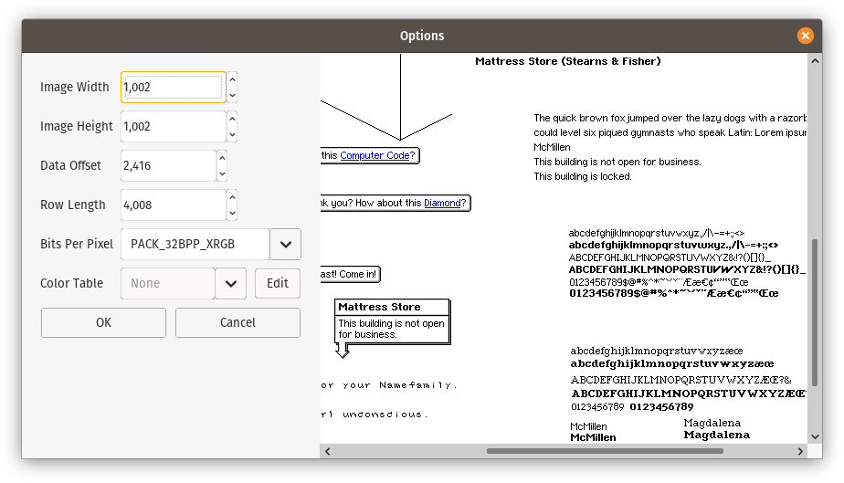

# bin2png

What started as a mission to retrieve some artwork from an AppleWorks 6 `.cwk` file turned into a standalone application to decode bitmaps in binary files.

## Options

	$ java -jar bin2png.jar --help
	bin2png - convert binary data to a bitmap image
	
	  -i <path>   specify input file
	  -I          specify standard input
	  -L          ask for input file
	  -w <int>    image width (pixels)
	  -h <int>    image height (pixels)
	  -s <int>    data offset (bytes)
	  -l <int>    scanline/row length (bytes)
	  -b <str>    pixel format/bits per pixel
	  -c <str>    color table
	  -d          no options/preview dialog
	  -D          show options/preview dialog
	  -f <str>    output format (default png)
	  -o <path>   specify output file
	  -O          specify standard output
	  -S          ask for output file

### Options for pixel format/bits per pixel

	PACK_1BPP_MSB_TO_LSB
	PACK_1BPP_LSB_TO_MSB
	PACK_2BPP_MSB_TO_LSB
	PACK_2BPP_LSB_TO_MSB
	PACK_4BPP_MSB_TO_LSB
	PACK_4BPP_LSB_TO_MSB
	PACK_8BPP
	PACK_15BPP_RGB555_BE
	PACK_15BPP_RGB555_LE
	PACK_15BPP_BGR555_BE
	PACK_15BPP_BGR555_LE
	PACK_16BPP_RGB565_BE
	PACK_16BPP_RGB565_LE
	PACK_16BPP_BGR565_BE
	PACK_16BPP_BGR565_LE
	PACK_16BPP_GRAY_BE
	PACK_16BPP_GRAY_LE
	PACK_16BPP_CUSTOM_BE
	PACK_16BPP_CUSTOM_LE
	PACK_24BPP_RGB
	PACK_24BPP_BGR
	PACK_32BPP_XRGB
	PACK_32BPP_XBGR
	PACK_32BPP_RGBX
	PACK_32BPP_BGRX
	PACK_32BPP_ARGB
	PACK_32BPP_ABGR
	PACK_32BPP_RGBA
	PACK_32BPP_BGRA

 ### Options for color table

 	Black to White
	White to Black
	Windows
	Windows (Eis)
	Windows (Paint)
	Windows (Web-Safe)
	Mac OS

 or any `.act` or indexed-color `.bmp` file.
 
